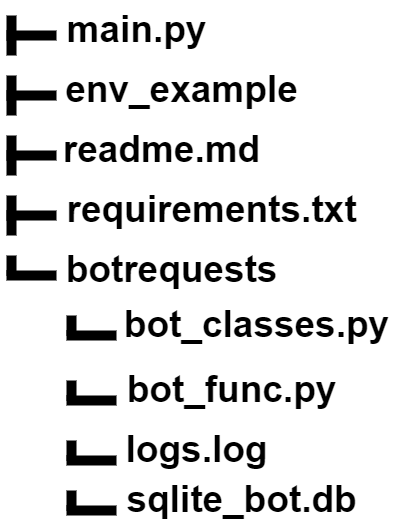
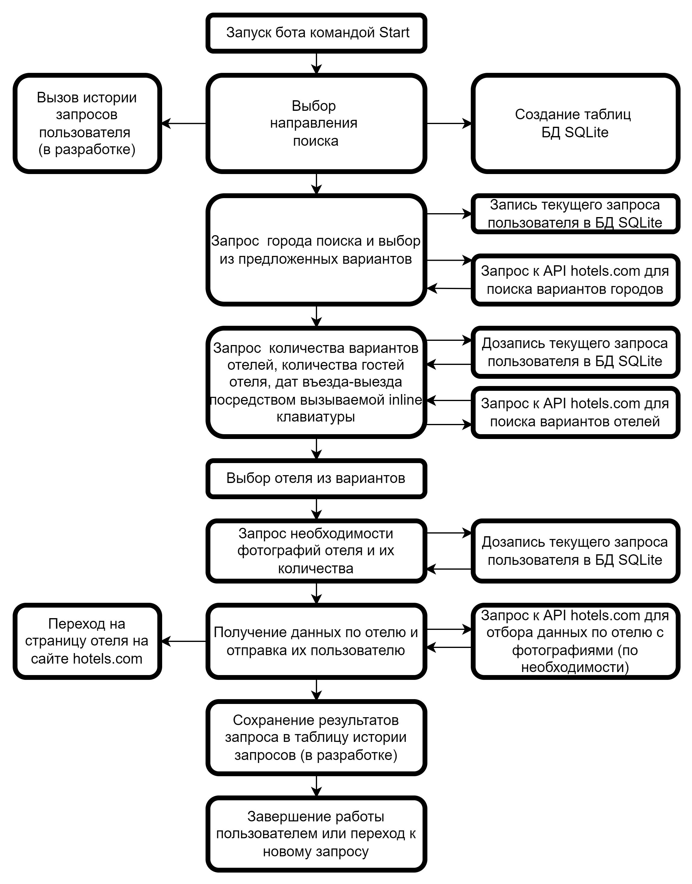

# Telegram бот для поиска отелей

Данный бот предназначен для поиска отелей, подпадающих под запросы пользователей. Он использует данные, полученные через API сайта rapidapi.com (hotels.com).

Бот FindYourHotelBot имеет следующую структуру файлов:

Схематически работу бота можно изобразить следующим образом:

## Модули Python, использованные при разработке

* [pyTelegramBotAPI](https://github.com/eternnoir/pyTelegramBotAPI) — работа с Telegram Bot API;
* [peewee](https://pypi.org/project/peewee/) — ОРМ peewee для взаимодействия с БД (в данном случае с SQLite);
* [python-dotenv](https://pypi.org/project/python-dotenv/) — для сокрытия токенов и добавления их данных в переменную среды;
* [requests](https://pypi.org/project/requests/) — для http-запросов с rapidapi.com;
* [loguru](https://pypi.org/project/loguru/) — для логирования работы бота;
* [python-telegram-bot-calendar](https://pypi.org/project/python-telegram-bot-calendar/) — для удобного ввода дат.

Исходные файлы будут расположены на [GitLab](https://git.).

## Установка

Скопируйте файл `env_example` как `.env` (с точкой в начале), откройте и отредактируйте содержимое (используйте токены своего телеграм бота и API rapidaip.com).

## Демонстрация работы

Бот установлен и может быть доступен по адресу: https://t.me/FindYourHotelBot. Демонстрация работы представлена ниже

## Благодарности

* еще будут
